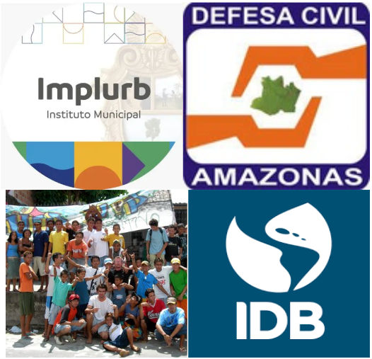

class:inverse, middle

background-image: "https://drive.google.com/drive/folders/11hjW6NbIPmSPC8Vp2xNlTdk_Osule0A2"
background-position: 95% 95%
background-size: 30%

# Monitoring informal urban expansion

## The Case of Manaus

<br>
<br>
<br>
<br>
<br>
<br>
<br>
<br>
<br>

### By As Palafitas

```{r setup, include=FALSE}
# First, We set some basic stuff for our presentation.
options(htmltools.dir.version = FALSE)
knitr::opts_chunk$set(
  fig.width= 9, fig.height = 3.5, fig.retina = 3,
  out.width = "100%",
  cache = FALSE,
  echo = FALSE,
  message = FALSE, 
  warning = FALSE,
  fig.show = TRUE,
  hiline = TRUE
)
```

```{r, echo=FALSE}
# We are going to add some extras.
# We upload package xaringanExtra.
library(xaringanExtra)

# We add a progress bar.
use_progress_bar(color = "#252C4F")

# We add a pencil.
use_scribble()

# We add the slide searcher.
use_tile_view()

```

```{r, include=FALSE, warning=FALSE, eval=TRUE}

# Finally, we are going to use the template provided by the Directorate of Markets and Statistics of the Undersecretary of Tourism of Argentina. 

# If you want to lean more, you can visit https://github.com/dnme-minturdep/comunicacion

library(xaringanthemer)
library(comunicacion)
style_mono_light(outfile = "dnmye_theme.css", # CSS FILE
                 # FONTS
                 header_font_google = google_font('Encode Sans'),
                 text_font_google   = google_font('Roboto'),
                 code_font_google   = google_font('IBM Plex Mono'),
                 # COLORES 
                 base_color = "#252C4F",
                 code_inline_color = dnmye_colores("rosa"), 
                 inverse_link_color = "#3B4449",
                 background_color = "#FFFFFF",
                 title_slide_background_position = "95% 5%", 
                 title_slide_background_size = "200px",
                 footnote_color = "#3B4449",
                 link_color = "3B4449",
                 text_slide_number_font_size = "16px")
```


---

background-image: url('gantt.png')
background-size: contain
background-position: center
background-repeat: no-repeat


---
class:inverse, center, middle

### Deliverables 1

#A Cloud-Based Map:
Live map showing all current precarious settlements and their types

---
class:inverse, center, middle

### Deliverables 2

#Monitoring Dashboard:
Provide an automatic notification of informal growth to Civil Defense

---
class:inverse, center, middle

### Deliverables 3

#Technical Report:
Project Viability report of accuracy and utility for the Mayor of Manaus

---
class:middle

<div style="position:relative; display:flex; align-items:flex-start; gap:1.2rem; width:100%; padding:0.6rem 0;">
  <div style="flex:1; text-align:left;">
    <h1 style="margin:0 0 0.6rem;">Stakeholders</h1>

    <p style="margin:0.2rem 0 0;"><strong>IMPLURB</strong></p>
    <ul style="margin:0.2rem 0 0 1.1rem; line-height:1.5;">
      <li>Owners of the data</li>
      <li>Enforcers of land use laws</li>
    </ul>

    <p style="margin:0.6rem 0 0;"><strong>Civil Defense (CD)</strong></p>
    <ul style="margin:0.2rem 0 0 1.1rem; line-height:1.5;">
      <li>Provide natural disaster aid</li>
      <li>Leads informal housing growth prevention</li>
    </ul>

    <p style="margin:0.6rem 0 0;"><strong>Public</strong></p>
    <ul style="margin:0.2rem 0 0 1.1rem; line-height:1.5;">
      <li>Planning must be participatory (Prefeitura de Manaus)</li>
      <li>Provide reasons for housing limits</li>
    </ul>

    <p style="margin:0.6rem 0 0;"><strong>International Organizations</strong></p>
    <ul style="margin:0.2rem 0 0 1.1rem; line-height:1.5;">
      <li>Inter‑American Development Bank (IDB)</li>
      <li>International Finance Corporation (IFC)
        <ul style="margin:0.2rem 0 0 1rem;">
          <li>Often fund infrastructure and development projects</li>
          <li>Potential sources of future funding</li>
        </ul>
      </li>
    </ul>
  </div>

  <!-- Image column pushed up -->
  <div style="flex:0 0 36%; text-align:center; align-self:flex-start; margin-top:0;">
    
  </div>

  <!-- Bottom-right sidenote with links -->
  <div style="position:absolute; right:0.8rem; bottom:0.6rem; font-size:0.72rem; color:#333; text-align:right; max-width:34%; line-height:1.15; pointer-events:auto;">
    <strong style="display:block; font-size:0.78rem; margin-bottom:0.12rem;">Sources</strong>
    <a href="https://www.gov.br/mdr/pt-br/assuntos/protecao-e-defesa-civil/defesa-civil-no-brasil-e-no-mundo-1/defesa-civil-no-brasil" target="_blank" rel="noopener noreferrer" style="color:inherit; text-decoration:underline; display:block; margin-bottom:0.12rem;">Defesa Civil — gov.br</a>
    <a href="https://www.facebook.com/people/Implurb/100064562117983/#" target="_blank" rel="noopener noreferrer" style="color:inherit; text-decoration:underline; display:block; margin-bottom:0.12rem;">Implurb — Facebook</a>
    <a href="https://1792exchange.com/company/inter-american-development-bank/" target="_blank" rel="noopener noreferrer" style="color:inherit; text-decoration:underline; display:block;">Inter‑American Development Bank — 1792exchange</a>
  </div>
</div>

---
background-image: url('exp_don.png')
background-size: contain
background-position: center
background-repeat: no-repeat


  