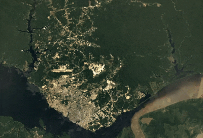
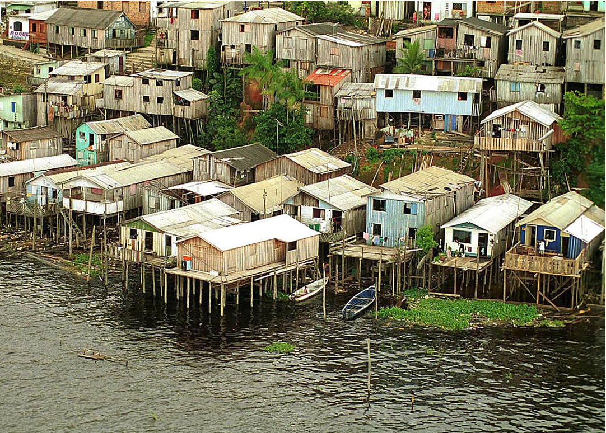
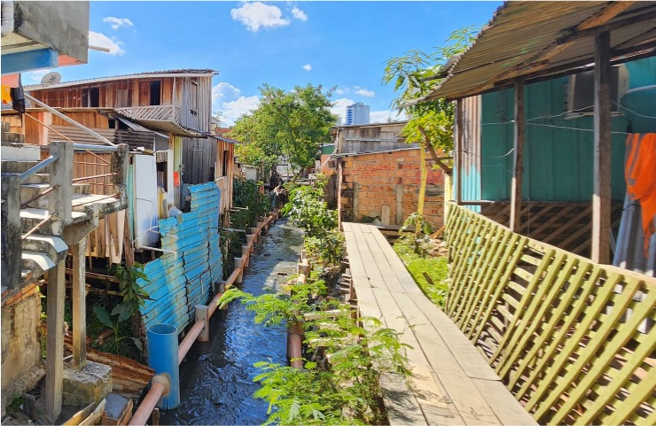
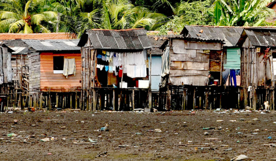
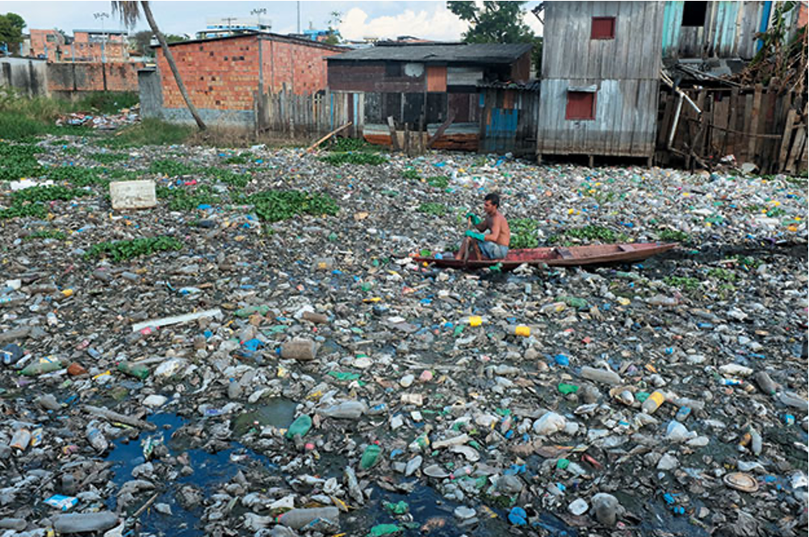
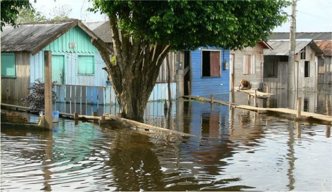

class:inverse

background-image: url("MANAUS_IMG.png")
background-position: center
background-size: cover

.pull-left[

<br>

# Remote Sensing for Monitoring Urban Expansion

### The Case of Manaus (Brazil)

]


```{r setup, include=FALSE}
# First, We set some basic stuff for our presentation.
options(htmltools.dir.version = FALSE)
knitr::opts_chunk$set(
  fig.width= 9, fig.height = 3.5, fig.retina = 3,
  out.width = "100%",
  cache = FALSE,
  echo = FALSE,
  message = FALSE, 
  warning = FALSE,
  fig.show = TRUE,
  hiline = TRUE
)
```

```{r, echo=FALSE}
# We are going to add some extras.
# We upload package xaringanExtra.
library(xaringanExtra)

use_panelset()

# We add a progress bar.
use_progress_bar(color = "#252C4F")

# We add a pencil.
use_scribble()

# We add the slide searcher.
use_tile_view()

```

```{r, include=FALSE, warning=FALSE, eval=TRUE}

# Finally, we are going to use the template provided by the Directorate of Markets and Statistics of the Undersecretary of Tourism of Argentina. 

# If you want to lean more, you can visit https://github.com/dnme-minturdep/comunicacion

library(xaringanthemer)
library(comunicacion)
style_mono_light(outfile = "dnmye_theme.css", # CSS FILE
                 # FONTS
                 header_font_google = google_font('Encode Sans'),
                 text_font_google   = google_font('Roboto'),
                 code_font_google   = google_font('IBM Plex Mono'),
                 # COLORES 
                 base_color = "#252C4F",
                 code_inline_color = dnmye_colores("rosa"), 
                 inverse_link_color = "#3B4449",
                 background_color = "#FFFFFF",
                 title_slide_background_position = "95% 5%", 
                 title_slide_background_size = "200px",
                 footnote_color = "#3B4449",
                 link_color = "3B4449",
                 text_slide_number_font_size = "16px")
```


---

class:inverse, middle

background-image: url("BRAZIL_IMG.png")
background-position: center
background-size: cover

---

# Manaus: The Amazon's Largest City

<br>

<div style="display: flex; align-items: flex-start; gap: 17px; margin-top: -50px;">

  <div style="flex: 0 0 55%;">
    <h3>- Located in the heart of the Amazon alongside the Rio Negro river, with a complex network of Igarapés running through the city</h3>
    <h3>- Population has exploded from 300,000 in 1970 to over 2 million people today</h3>
  </div>

  <div style="flex: 0 0 45%; margin-top: 40px;">
    
  </div>

</div>

<h3 style="margin-top: 10px;">- Growth lacked formal planning, making informal settlements a 'tradition'</h3>

---

<style>

.panelset {
   --panel-tab-font-size: 32px;       /* Change this number to go even bigger */
   --panel-tab-color: #252C4F;        /* Keeps the text white */
   --panel-tab-inactive-opacity: 0.5; /* Makes unselected tabs faded */
   --panel-tab-active-foreground: #252C4F;
}


.panel-tabs {
   margin-bottom: 30px !important;
}
</style>

# Palafitas: Precarious Settlements

.panelset[
.panel[.panel-name[Banks of large rivers]
<div style="float: center; width: 70%; padding-top: 5px;">

</div>
]

.panel[.panel-name[Igarapés]
<div style="float: center; width: 50%; padding-top: 20px;">
  
</div>
]

.panel[.panel-name[Wetlands & Urban Plateaus]
<div style="float: center; width: 60%;">
  
</div>
]

] <div style="clear: both;"></div>

---
class:center, middle

# What environmental risks do Palafitas face?

---

class: center

### Stilts dug into the riverbed/banks

---

class:center

### Stilts dug into the riverbed/banks

<div style="text-align: center; font-size: 2.25em; margin: -10px 0;">
  <span>&#8601;</span> &nbsp;&nbsp;&nbsp;&nbsp;&nbsp;&nbsp; <span>&#8600;</span> </div>
  
.pull-left[

### Debris (natural & rubbish) flowing in the river gets stuck in stilts

]

.pull-right[

### Sediment is suspended in water and settles around base of the houses

]

---

class:center

### Stilts dug into the riverbed/banks

<div style="text-align: center; font-size: 2.25em; margin: -10px 0;">
  <span>&#8601;</span> &nbsp;&nbsp;&nbsp;&nbsp;&nbsp;&nbsp; <span>&#8600;</span> </div>
  
.pull-left[

### Debris (natural & rubbish) flowing in the river gets stuck in stilts

]

.pull-right[

### Sediment is suspended in water and settles around base of the houses

]

<div style="text-align: center; font-size: 2.25em; margin: -10px 0;">
  <span>&#8600;</span> &nbsp;&nbsp;&nbsp;&nbsp;&nbsp;&nbsp;&nbsp;&nbsp;&nbsp;&nbsp;&nbsp;&nbsp;&nbsp;&nbsp;&nbsp;&nbsp;&nbsp;&nbsp;&nbsp;&nbsp;&nbsp;&nbsp;&nbsp;&nbsp;&nbsp;&nbsp;&nbsp;&nbsp;&nbsp;&nbsp;&nbsp;&nbsp;&nbsp;&nbsp; <span>&#8601;</span> </div>

### Blocks natural drainage systems

---
class: center

### Stilts dug into the riverbed/banks

<div style="text-align: center; font-size: 2.25em; margin: -10px 0;">
  <span>&#8601;</span> &nbsp;&nbsp;&nbsp;&nbsp;&nbsp;&nbsp; <span>&#8600;</span> </div>
  
.pull-left[

### Debris (natural & rubbish) flowing in the river gets stuck in stilts

]

.pull-right[

### Sediment is suspended in water and settles around base of the houses

]

<div style="text-align: center; font-size: 2.25em; margin: -10px 0;">
  <span>&#8600;</span> &nbsp;&nbsp;&nbsp;&nbsp;&nbsp;&nbsp;&nbsp;&nbsp;&nbsp;&nbsp;&nbsp;&nbsp;&nbsp;&nbsp;&nbsp;&nbsp;&nbsp;&nbsp;&nbsp;&nbsp;&nbsp;&nbsp;&nbsp;&nbsp;&nbsp;&nbsp;&nbsp;&nbsp;&nbsp;&nbsp;&nbsp;&nbsp;&nbsp;&nbsp; <span>&#8601;</span> </div>

### Blocks natural drainage systems

<div style="text-align: center; font-size: 2.25em;">&darr;</div>

### Increases flood chance & severity
---

# Vulnerability to disasters

<div style="width: 100%; display: flex; align-items: flex-start; gap: 20px; margin-top: -40px;">

  <div style="flex: 0 0 60%; text-align: left;">
    <h3>- Lack of basic services &rarr; waste dumped into waterways</h3>
    <h3>- Area is prone to waterborne diseases & landslides</h3>
    <h3>- More natural disaster alerts than any other Brazilian city (2024)</h3>
    <h3>- 438 at-risk areas + 112,000 people in precarious settlements</h3>
  </div>

  <div style="flex: 0 0 40%; text-align: center;">
    
    
  </div>

</div>

<div style="clear: both;"></div>

---

# What can be done?

--

<br>

### 1. Map existing informal settlements

+ #### Inform re-urbanization programs (e.g., improving draining infrastructure)

+ #### Environmental rehabilitation (e.g., rubbish clearing, reinforce embankments)

--

### 2. Create a warning system to detect land being cleared for new informal settlements

+ #### Stop people settling in dangerous areas before consolidation

+ #### Encourage these people moving into social housing

---

# Benefits to the community

### 1. Improve Life Safety

+ #### Increase resilience during floods

+ #### Reduce prevalence of waterborn diseases

### 2. Environmental Preservation

+ #### Protect ecological corridors (rivers & *igarapés*)

### 3. Social Inclusion

+ #### Provide people with property titles and basic services (water, light, sewage) from the start of an occupation through planned land subdivision


---

class: center, middle

<div style="display: flex; align-items: center; justify-content: center; gap: 40px; margin-top: 60px;">
  <div style="background: #252C4F; color: white; padding: 30px 40px; border-radius: 10px; font-size: 1.4em; font-weight: bold; max-width: 280px; text-align: center;">
    Benefits to the Community
  </div>
  <div style="font-size: 3em; color: #252C4F; font-weight: bold;">
    &#8596;
  </div>
  <div style="background: #252C4F; color: white; padding: 30px 40px; border-radius: 10px; font-size: 1.4em; font-weight: bold; max-width: 280px; text-align: center;">
    Development Agendas
  </div>
</div>

---
class: center, middle

<div style="display: flex; flex-direction: column; align-items: center; gap: 0px;">
  <div style="background: #252C4F; color: white; padding: 20px 60px; border-radius: 10px; font-size: 1.6em; font-weight: bold;">
    Development Agendas
  </div>
  <div style="display: flex; gap: 80px; align-items: flex-start; justify-content: center; margin-top: 10px;">
    <div style="display: flex; flex-direction: column; align-items: center; gap: 6px;">
      <div style="font-size: 2em; color: #252C4F; transform: rotate(30deg); display: inline-block;">&#8595;</div>
      <div style="background: #f0f2f8; border: 2px solid #252C4F; color: #252C4F; padding: 16px 32px; border-radius: 8px; font-size: 1.2em; font-weight: bold;">
        Global
      </div>
    </div>
    <div style="display: flex; flex-direction: column; align-items: center; gap: 6px;">
      <div style="font-size: 2em; color: #252C4F;">&#8595;</div>
      <div style="background: #f0f2f8; border: 2px solid #252C4F; color: #252C4F; padding: 16px 32px; border-radius: 8px; font-size: 1.2em; font-weight: bold;">
        National
      </div>
    </div>
    <div style="display: flex; flex-direction: column; align-items: center; gap: 6px;">
      <div style="font-size: 2em; color: #252C4F; transform: rotate(-30deg); display: inline-block;">&#8595;</div>
      <div style="background: #f0f2f8; border: 2px solid #252C4F; color: #252C4F; padding: 16px 32px; border-radius: 8px; font-size: 1.2em; font-weight: bold;">
        Local
      </div>
    </div>
  </div>
</div>

---

## Alignment with Development Goals

.panelset[
.panel[.panel-name[Global]

### UN Sustainable Development Goals (SDGs)

* **SDG 6:** Ensure availability and sustainable management of water and sanitation for all.
* **SDG 11:** Make cities and human settlements inclusive, safe, resilient, and sustainable.

<div style="text-align: center;">


</div>

> **Project Impact:** Monitoring palafitos directly supports **Target 11.1** (access to adequate, safe, and affordable housing and basic services) by providing data on vulnerable informal settlements.

]

.panel[.panel-name[National]

### City Statute (Federal Law 10.257/2001)

* **Art. 2, I:** Guarantees the right to sustainable cities, including urban land, housing, and environmental sanitation.
* **Art. 2, IV:** Mandates democratic management through the planning and control of land use.
* **Art. 42, I:** Requires a mandatory Master Plan for cities with over 20,000 inhabitants (like Manaus).

> **Project Impact:** Remote sensing provides the "control of land use" required by federal law, allowing the Executive Power to fulfill its duty of urban oversight and infrastructure planning.

]

.panel[.panel-name[Local]

### Manaus Master Plan (Plano Diretor, 2021)

* **Art. 25, III:** Focuses on preventing environmental degradation and protecting watercourse banks from irregular squatting.
* **Art. 32, V:** Mandates the **Social Housing Policy** to resettle low-income populations from risk areas to safer locations with better infrastructure.
* **Art. 111:** Defines **Areas of Special Social Interest (AEIS)**.

> **Project Impact:** By using Remote Sensing to identify growth early, the city can transition from *reacting* to irregular slums to *proactively* declaring AEIS for planned, dignified housing.
]
]

---
class: inverse center middle

# WORKFLOW

---

## Classification by Multi-Spectral Optical Imagery

**Dos Santos et al (2022)** demonstrated use of optical EO imagery from China-Brazil Resources Satellite-4A (CBERS-4A) for classifying urban fabric typologies in the Amazon, including precarious settlements<sup>1</sup>:
1. **Crop to study area**
2. **Combine panchromatic and multi-spectral images**
3. **Calculate indices as new channels**
  * Normalized Difference Vegetation Index (NVDI)
  * Normalized Difference Roof Index (NDRI)
  * Bare Soil Area Index (BSAI)
4. **Calculate texture metrics with 25x25 kernel**
  * variance
  * entropy
  * contrast
  * correlation
  * uniformity
5. **Generating objects with mean-shift clustering**
6. **Classification with decision tree model**

---

## Weaknesses of That Approach

<br>

1. CBERS-4A only captures 8m resolution imagery once every 31 days<sup>1</sup>

2. Clouds are common in the rainforest<sup>2</sup>

3. Texture metrics with such a large kernel and and objects with minimum size may miss very small incursions

4. The decision tree model implemented by Dos Santos et al (2022) does not output a probabilities, only a hard classification

5. We really only need a binary classification


---

## Improvements/Solutions/Alternatives

<br>

1. Sentinel-2 has nearly the same resolution (10m) and returns every 5 days<sup>3</sup>

2. Sentinel-1 carries C-band SAR and returns every 6 days<sup>4</sup>

3. **Moya et al.** demonstrated that pixel-wise classification by SAR can identify changes quickly in Lima, Peru<sup>5</sup>
  * Simple threshold based on historical mean and standard deviation in VV polarization
  * Classic and cheap/fast image processing operations
    + opening
    + closing
    + blob analysis
  * Identified 84% of informal settlement identified by visual inspection

---

## Our Synthesized Approach

<br>

1. Train pixel-wise Random Forest classifier on Sentinel-2 and Sentinel-1 data in vicinity of Manaus
  * Scale SAR from 5m resolution to 10m to match multi-spectral resolution
  * Only two classes (nature and cleared/developed)
  * Indices from multi-spectral
  * Output predicted probability
  * Spatial CV to avoid overfitting and an optimistic bias in performance metrics<sup>6</sup>

2. Calculate the predicted probability for each pixel in designated sensitive areas every time Sentinel-1 or Sentinel-2 passes overhead and record for posterity

3. Work with officials to determine suitable predicted probability threshold to balance TPR and FPR

4. Experimentally determine suitable opening and closing kernel size if necessary and minimum blob size

5. Compare each new set of blobs to the previous ones and alert local officials to new or expanded blobs

---

# Integration into city management

.pull-left[

**Urban Planning**

+ Integrated into the Planning Information System

  + Housing
  
  + Transport
  
  + Public Services

+ Made available through GIS services and dashboards 

**Mitigation**

+ Early warning system to halt irregular building before consolidation

]

.pull-right[

**Risk and Resilience**

+ Integrated into Rapid Response Systems 


**Open Data and Open Government**

+ Open Data Portal

+ Transparency 


**Capacity Building and Operational Sustainability**

+ Training municipal staff

+ Definition of User protocols and documentation

+ Open workshops

]

---

class: inverse center middle

# Schedule and Budget

---

background-image: url('gantt5.png')
background-size: contain
background-position: center
background-repeat: no-repeat


---
class:inverse, center, middle

### Deliverables 1

#Monitoring Dashboard:
Provide an automatic notification of informal growth to Civil Defense

---
class:inverse, center, middle

### Deliverables 2

#Technical Report:
Project Viability report of accuracy and utility for the Mayor of Manaus

---
class:middle

<div style="position:relative; display:flex; align-items:flex-start; gap:1.2rem; width:100%; padding:0.6rem 0;">

  <!-- TEXT COLUMN -->
  <div style="flex:1; text-align:left;">
    <h1 style="margin:0 0 0.6rem;">Stakeholders</h1>

    <p style="margin:0.2rem 0 0;"><strong>IMPLURB</strong><sup>9</sup></p>
    <ul style="margin:0.2rem 0 0 1.1rem; line-height:1.5;">
      <li>Owners of the data</li>
      <li>Enforcers of land use laws</li>
    </ul>

    <p style="margin:0.6rem 0 0;"><strong>Civil Defense (CD)</strong><sup>7</sup></p>
    <ul style="margin:0.2rem 0 0 1.1rem; line-height:1.5;">
      <li>Provide natural disaster aid</li>
      <li>Leads informal housing growth prevention</li>
    </ul>

    <p style="margin:0.6rem 0 0;"><strong>Public</strong></p>
    <ul style="margin:0.2rem 0 0 1.1rem; line-height:1.5;">
      <li>Planning must be participatory (Prefeitura de Manaus)</li>
      <li>Provide reasons for housing limits</li>
    </ul>

    <p style="margin:0.6rem 0 0;"><strong>International Organizations</strong></p>
    <ul style="margin:0.2rem 0 0 1.1rem; line-height:1.5;">
      <li>Inter‑American Development Bank (IDB)<sup>8</sup></li>
      <li>International Finance Corporation (IFC)<sup>10</sup>
        <ul style="margin:0.2rem 0 0 1rem;">
          <li>Often fund infrastructure and development projects</li>
          <li>Potential sources of future funding</li>
        </ul>
      </li>
    </ul>
  </div>

  <!-- IMAGE COLUMN (now inside the flex container) -->
  <div style="flex:0 0 36%; text-align:center; align-self:flex-start; margin-top:0;">
    
  </div>

  <!-- BOTTOM-RIGHT IMAGE SOURCES -->
  <div style="position:absolute; right:0.8rem; bottom:0.6rem; font-size:0.72rem; color:#333; text-align:right; max-width:34%; line-height:1.15; pointer-events:auto;">
    <strong style="display:block; font-size:0.78rem; margin-bottom:0.12rem;">Image Sources</strong>
    <a href="https://www.gov.br/mdr/pt-br/assuntos/protecao-e-defesa-civil/defesa-civil-no-brasil-e-no-mundo-1/defesa-civil-no-brasil" target="_blank" rel="noopener noreferrer" style="color:inherit; text-decoration:underline; display:block; margin-bottom:0.12rem;">Defesa Civil — gov.br</a>
    <a href="https://www.facebook.com/people/Implurb/100064562117983/#" target="_blank" rel="noopener noreferrer" style="color:inherit; text-decoration:underline; display:block; margin-bottom:0.12rem;">Implurb — Facebook</a>
    <a href="https://1792exchange.com/company/inter-american-development-bank/" target="_blank" rel="noopener noreferrer" style="color:inherit; text-decoration:underline; display:block;">Inter‑American Development Bank — 1792exchange</a>
  </div>

</div>

---
background-image: url('exp_don.png')
background-size: contain
background-position: center
background-repeat: no-repeat


---


class:  center


# Workflow References

.footnote[[1] Santos, B. D. dos, C. M. D. de Pinho, G. E. T. Oliveira, et al. (2022). "Identifying Precarious Settlements and Urban Fabric Typologies Based on GEOBIA and Data Mining in Brazilian Amazon Cities". En. In: Remote Sensing 14.3, p. 704. ISSN: 2072-4292. DOI: 10.3390/rs14030704. URL: https://www.mdpi.com/2072-4292/14/3/704 (visited on Mar. 20, 2026).

[2] Assunção, J., C. Gandour, and R. Rocha (2017). "DETERring deforestation in the Amazon: environmental monitoring and law enforcement".

[3] Earth Science Data Systems, NASA. “Sentinel-2 Multispectral Imager | NASA Earthdata.” Instrument. Earth Science Data Systems, NASA, September 5, 2024. https://www.earthdata.nasa.gov/data/instruments/sentinel-2-msi.

[4] Earth Science Data Systems, NASA. “Synthetic Aperture Radar (SAR) | NASA Earthdata.” Data Basics. Earth Science Data Systems, NASA, May 18, 2021. https://www.earthdata.nasa.gov/learn/earth-observation-data-basics/sar.


[5] Moya, L., F. Garcia, C. Gonzales, et al. (2022). "Brief communication: Radar images for monitoring informal urban settlements in vulnerable zones in Lima, Peru". In: Natural Hazards and Earth System Sciences 22.1, pp. 65-70. ISSN: 1561-8633. DOI: 10.5194/nhess-22-65-2022.

[6] Karasiak, N., Dejoux, JF., Monteil, C. et al. Spatial dependence between training and test sets: another pitfall of classification accuracy assessment in remote sensing. Mach Learn 111, 2715–2740 (2022).]

---

class:  center


# Schedule and Budget References

[7] COORDENADORIA ESTADUAL DA DEFESA CIVIL (no date). Available at: https://www.defesacivil.pr.gov.br/ (Accessed: March 22, 2026).

[8] IDB | Inter American Development Bank (no date). Available at: https://www.iadb.org/en (Accessed: March 22, 2026).

[9] IMPLURB | Prefeitura de Manaus (no date). Available at: https://www.manaus.am.gov.br/implurb/ (Accessed: March 22, 2026).

[10] International Finance Corporation (IFC) (no date). Available at: https://www.ifc.org/en/home (Accessed: March 22, 2026).

#### Budget References

Melhores Computadores para Engenharia até 10 mil reais em 2025 | elite computadores (no date). Available at: https://www.elitecomputadores.com.br/melhores-computadores-para-engenharia-ate-10-mil-reais-em-2025 (Accessed: March 22, 2026).

Salários dos programadores Manaus (Brasil) en reales brasileños (no date). Available at: https://bdeex.com/pt-br/brazil/manaus/?type=it (Accessed: March 22, 2026).


---
class: inverse center middle

# OBRIGADO!
